## Домашнее задание к занятию 5. «Практическое применение Docker» - Шаров Олег

## 👤 Студент
Олег Шаров | `os127@yandex.ru` | GitHub: [@Myth3916](https://github.com/Myth3916)

```markdown
# 🐳 DevOps Homework 05: Docker, Compose & Cloud Deployment

## 📋 Описание
Учебный проект, демонстрирующий навыки контейнеризации, оркестрации, облачного деплоя и оптимизации Docker-образов. Веб-приложение на **FastAPI + MySQL** развёрнуто в изолированной Docker-сети, доступно через цепочку прокси (Nginx → HAProxy), автоматически деплоится на ВМ в Yandex Cloud, а база данных регулярно бэкапится.
```

## 🏗️ Архитектура
```
 Пользователь
    ↓ (port 8090)
🟢 Nginx (Ingress Proxy)
    ↓ (port 8080)
🟡 HAProxy (Reverse Proxy)
    ↓ (port 5000)
🐍 FastAPI App (Python 3.12)
    ↓
 MySQL 8 (Database)
```

---

## ✅ Задача 0: Проверка Docker Compose

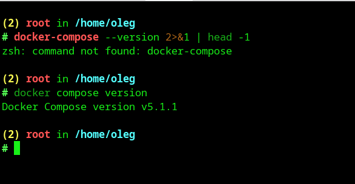

---

## ✅ Задача 1: Dockerfile и сборка приложения

### Структура проекта
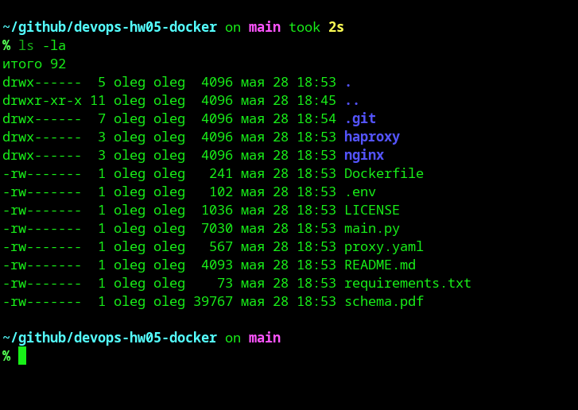

### Dockerfile.python (multistage сборка)
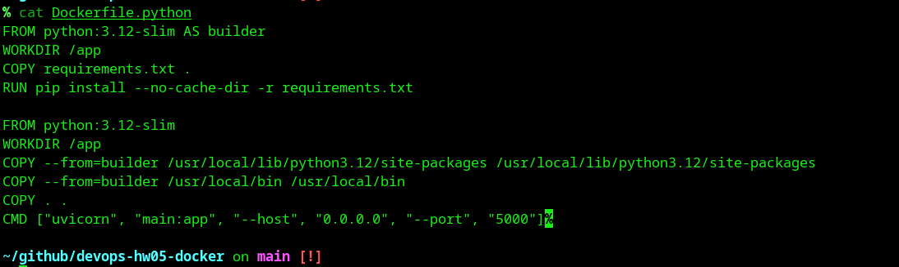

### .dockerignore
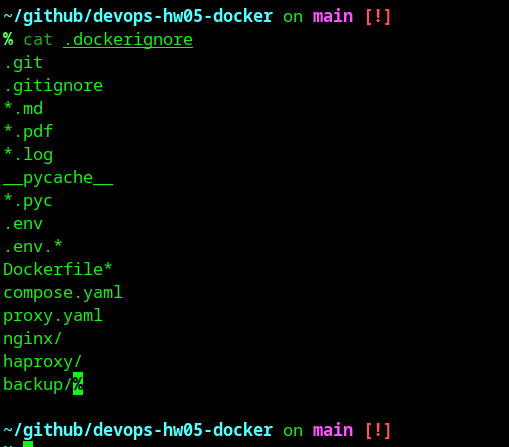

### .gitignore
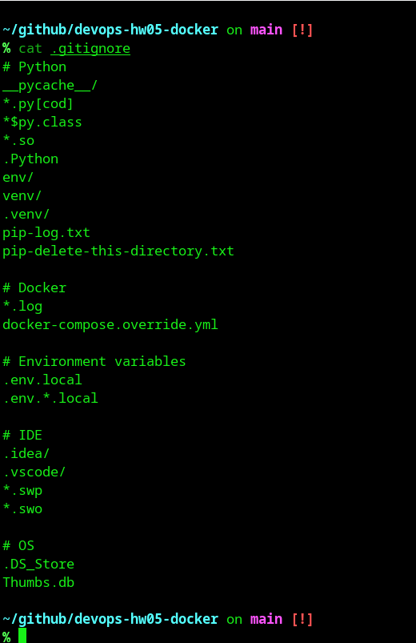

### Успешная сборка
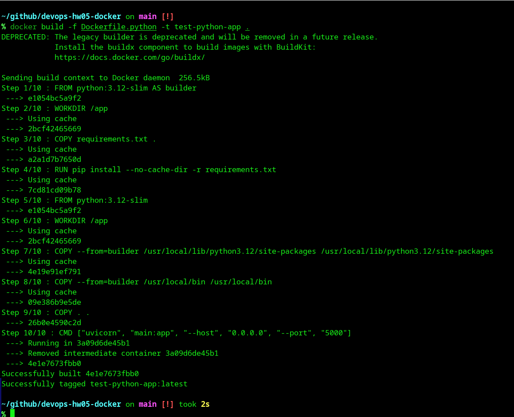

### Запуск приложения
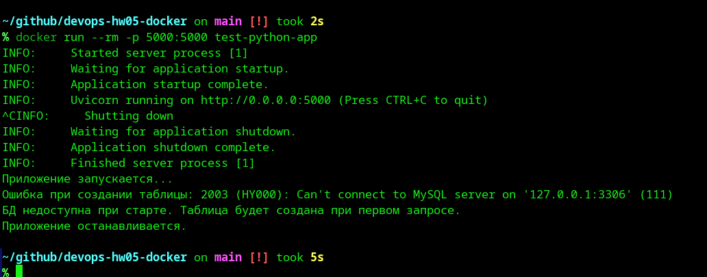

### Git commit
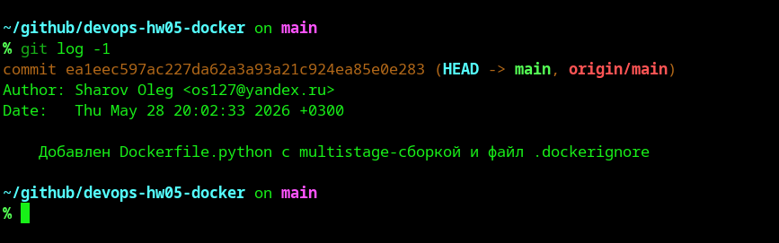

---

## ✅ Задача 3: Docker Compose оркестрация

### SQL-запрос к базе данных
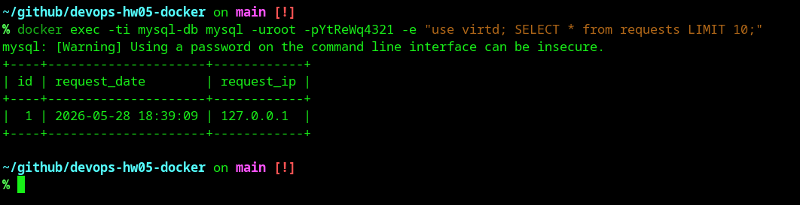

---

## ✅ Задача 4: Деплой в Yandex Cloud

### Создание ВМ
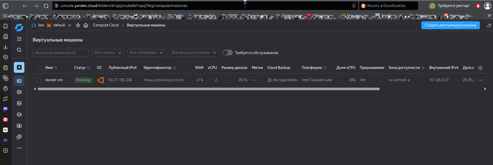

### Подключение по SSH
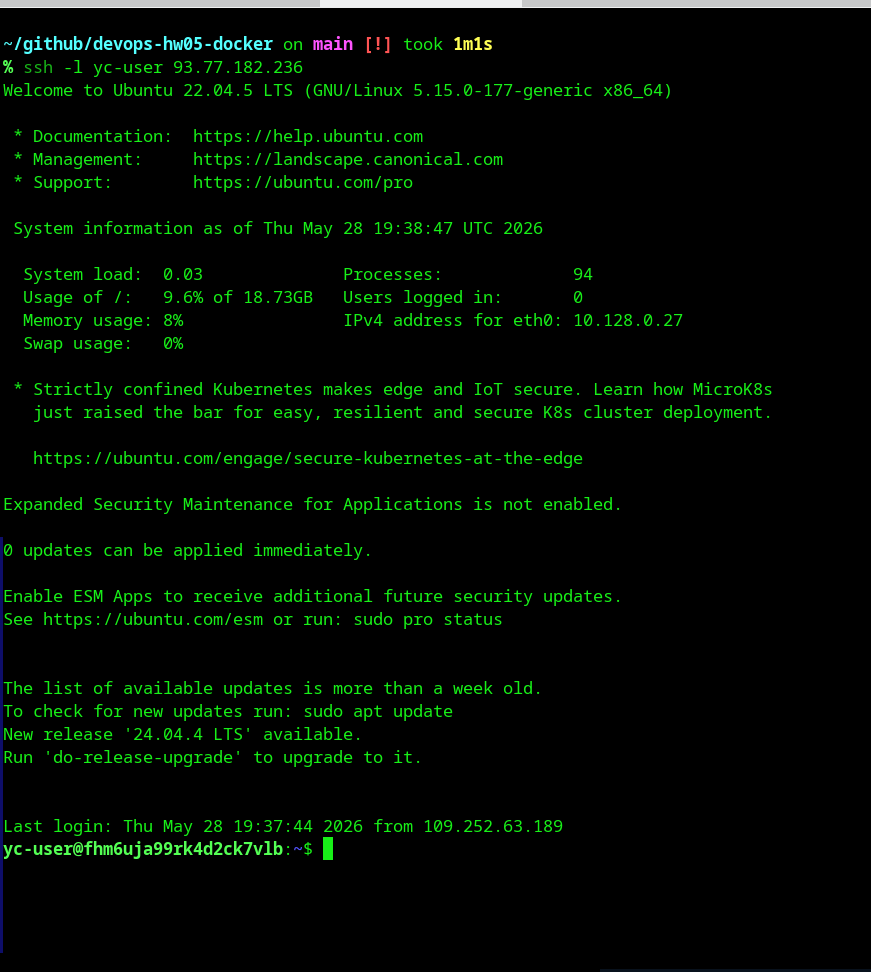

### Установка Docker
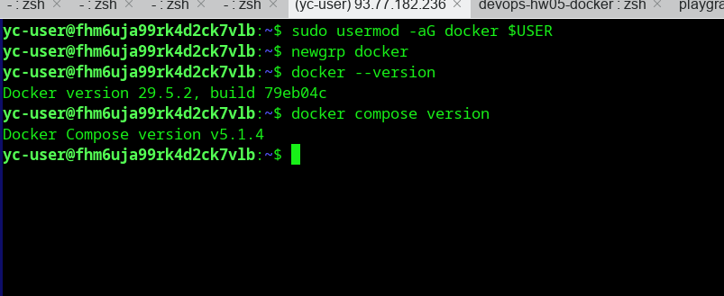

### Скрипт деплоя
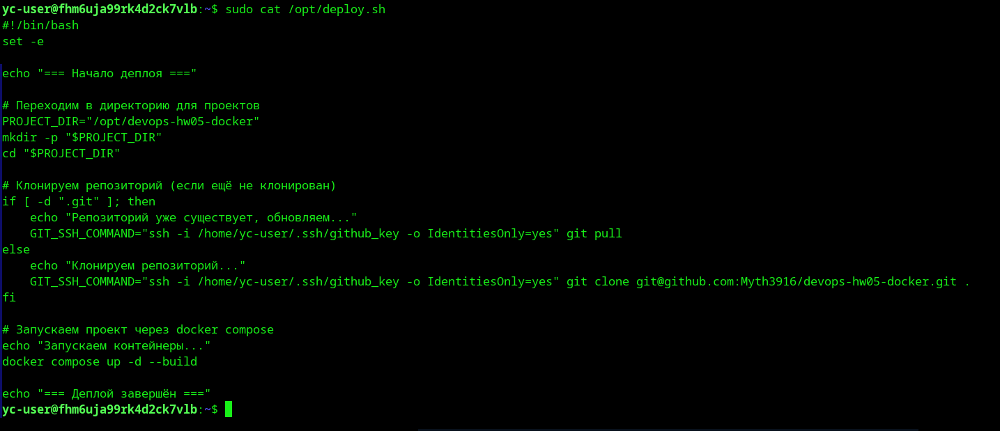

### Запуск деплоя
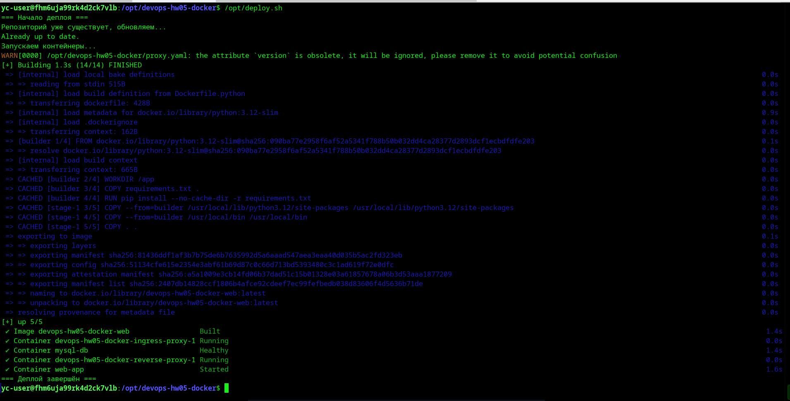

### Статус контейнеров
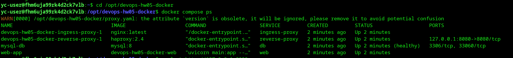

### Проверка локально (на ВМ)
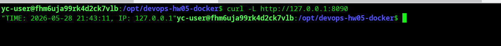

### Проверка удалённо (с локальной машины)
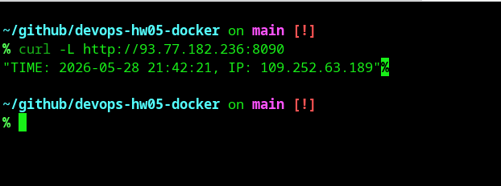

### Проверка доступности (check-host.net)
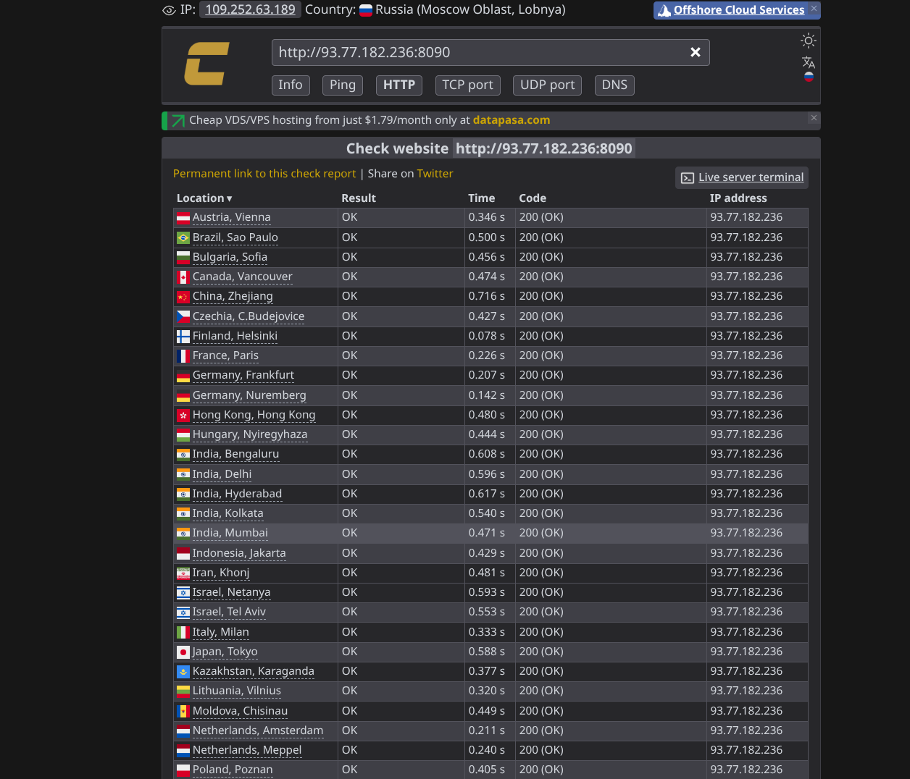

---

## ✅ Задача 5: Резервное копирование БД

### Скрипт бэкапа
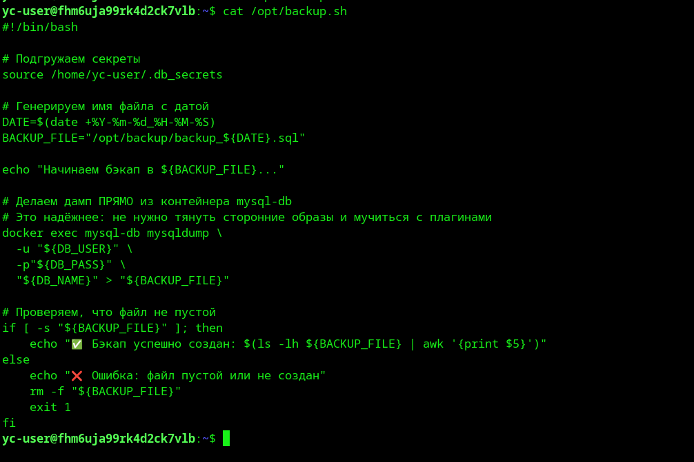

### Настройка Cron
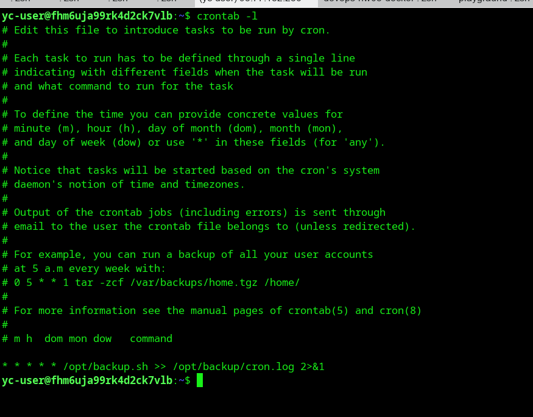

### Файлы бэкапов
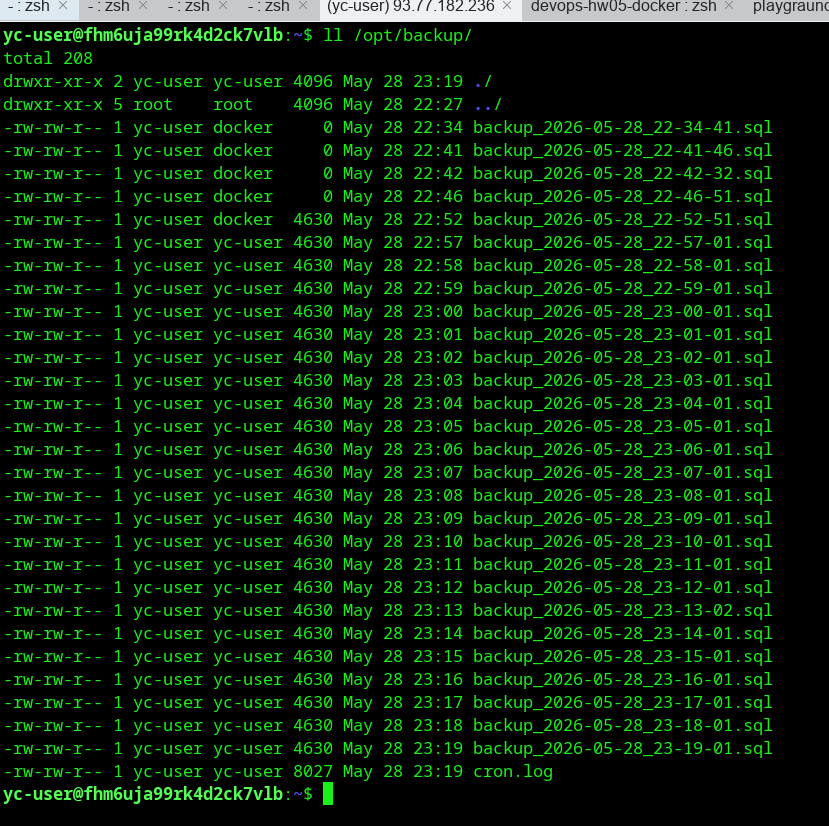

### Содержимое бэкапа
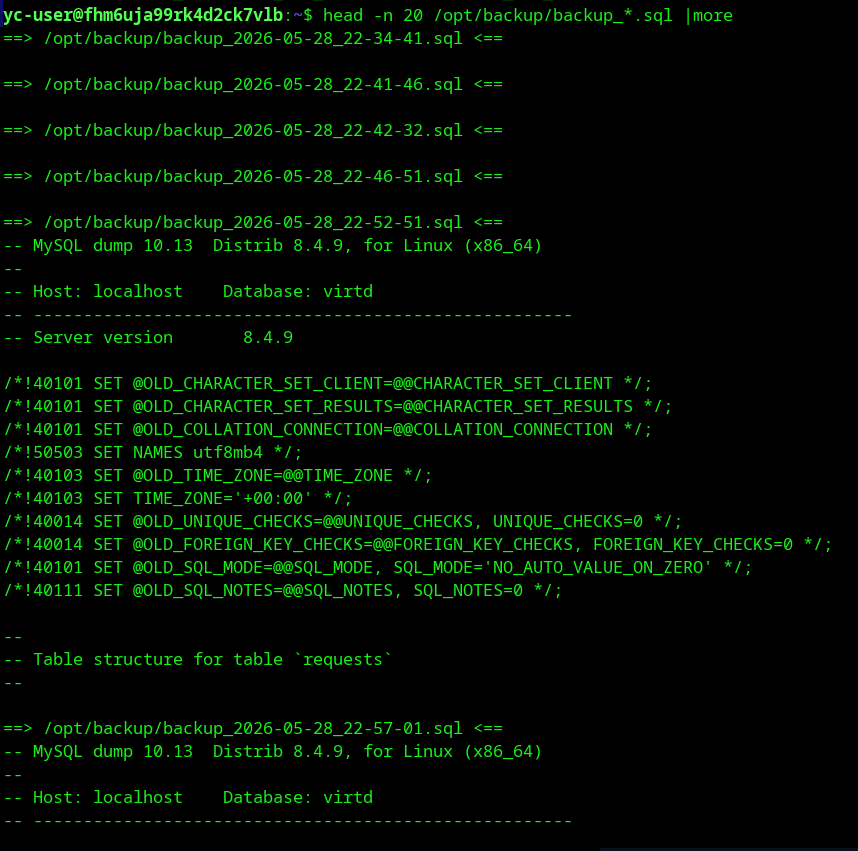

---

## ✅ Задача 6: Оптимизация образа Terraform

### Сравнение размеров образов
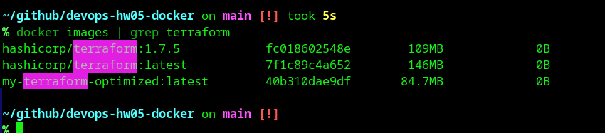

### Анализ оптимизированного образа (100% efficiency!)
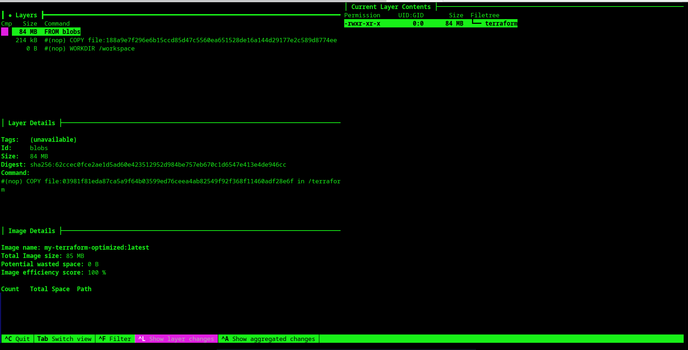

### Проверка работы Terraform
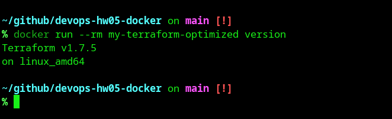

---

## 🚀 Локальный запуск
1. Убедитесь, что Docker и Docker Compose установлены
2. Настройте переменные окружения в `.env`
3. Запустите проект:
   ```bash
   docker compose up -d --build
   ```
4. Проверьте работу:
   ```bash
   curl -L http://127.0.0.1:8090
   ```

## 📦 Технологии
- **Backend:** Python 3.12, FastAPI, Uvicorn
- **Database:** MySQL 8
- **Proxy:** Nginx, HAProxy
- **Infra:** Docker, Docker Compose, Yandex Cloud
- **Tools:** Dive, Git, Bash, Cron

```